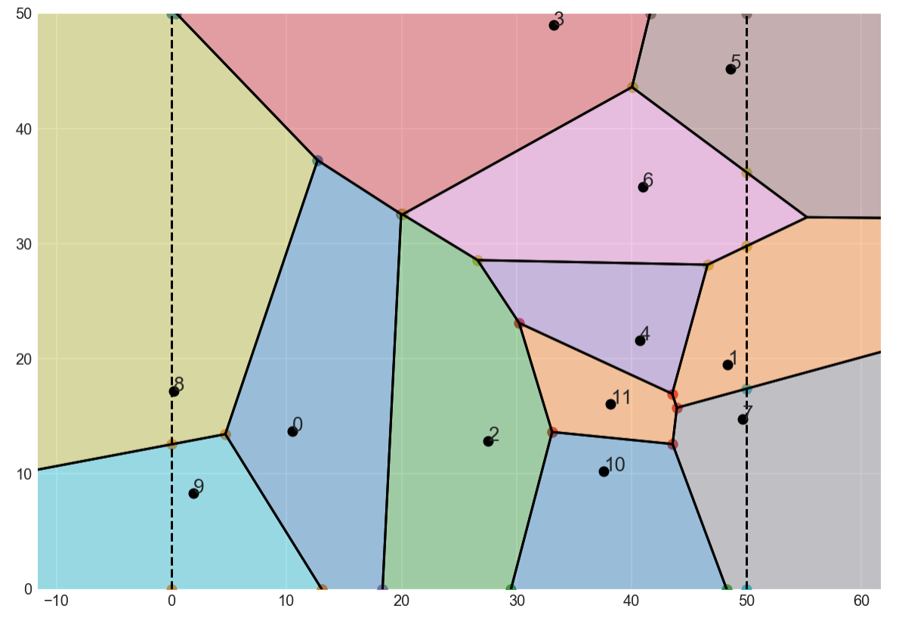
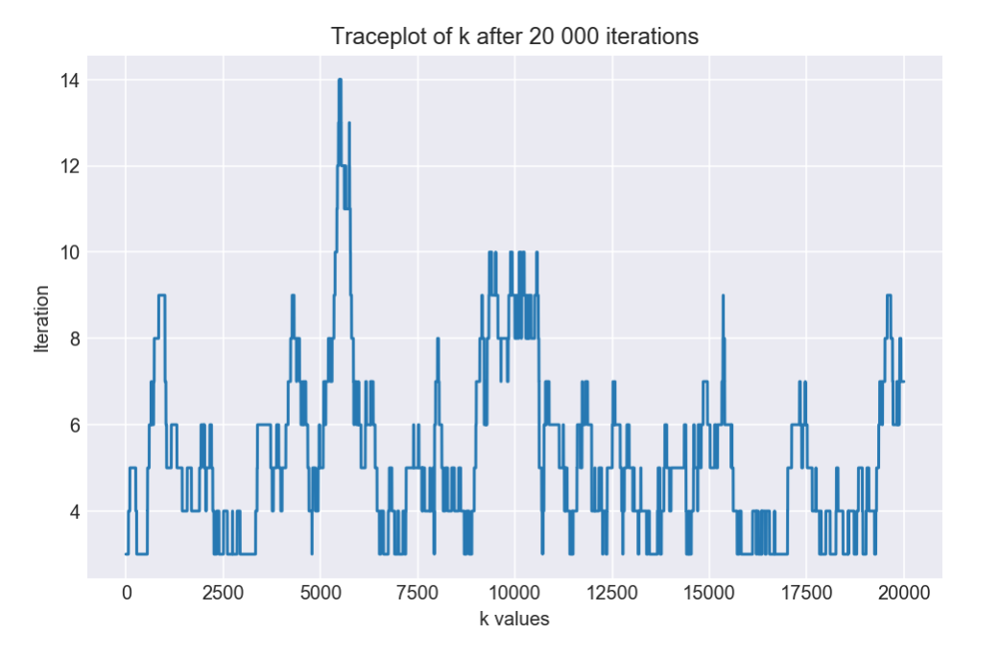

# Image Segmentation using Reversible Jump MCMC

#### Final Project for MATH 598

Reversible Jump Markov Chain Monte Carlo (RJMCMC) is an extension of MCMCs which allows parameters to be sampled across different sample spaces. Introduced in [Green (1995)](https://academic.oup.com/biomet/article-abstract/82/4/711/252058), three examples of applications of the RJMCMC method are provided, one of which consists of denoising a synthesized blurred image via Voronoi tesselation.

### Voronoi Tesselation

Voronoi tesselation (or [Voronoi diagram](https://en.wikipedia.org/wiki/Voronoi_diagram)) is a partition of a plane in which $k$ generating points define the tesselation. In a 2D setting, all points $(u, v) \in \mathbb{R}^2$ are associated to one of the $k$ generating points, whichever is closest in $L2$ distance. The `voronoi_finite_polygons_2d` in `src/helper.py` is the Python code that defines the tesselation, inspired from `scipy.spatial.Voronoi`.

### Image Segmentation

As example of the posterior "denoised" image is provided in the first figure above titled "Deblurred image". The inference procedure is as followed: $k$ points are sampled randomly in a $50 \times 50$ grid such that a Voronoi tesselation is defined (see image above). A height $h_i$ for tile/region $i \in \{1, \dots, k\}$ is given to each tesselation region by sampling from a Normal conditional posterior distribution centered at the mean of pixel-valued grayscale intensities of neighboring tiles. RJMCMC was used to determine the number of tiles between each Gibbs sample iteration whereby an extra tessalation point can be added or removed. As a result, $k$ can take three possible values in any subsequent iteration: $k-1, k$ or $k+1$.

### Challenges

This project was done around April 2018 as a final project for a graduate course in Bayesian inference with Professor David Stephens. My final report is available in this repository under `report.pdf`.

A major limitation is that our "Deblurred image" doesn't seem as polished as the results in the original paper. This is most likely due to an error in the Gibbs sampler (see `notebooks/voronoi-tesselation-v2.ipynb`) where I seem to run into issues where $k$ falls below $3$.